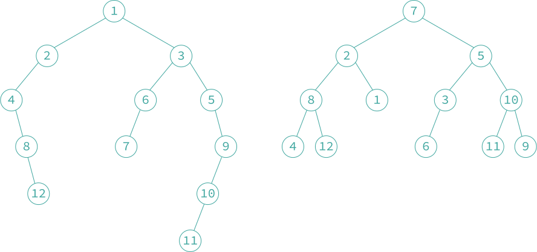

### 10.1 AVL 树

- **「AVL 树 AVL tree」** 即平衡树，在这种二叉树上的插入和删除操作的时间复杂度均为 $$O(\log n)$$，且结果二叉树在高度上仍保持平衡。一棵空二叉树是高度平衡的。如果 $$T$$ 是一棵非空的二叉树，$$T_L$$ 和 $$T_R$$ 分别是其左子树和右子树，那么 $$T$$ 是高度平衡的当且仅当：
  1. $$T_L$$ 和 $$T_R$$ 是高度平衡的；
  2. $$|h_L - h_R| \leq 1$$，其中 $$h_L$$ 和 $$h_R$$ 分别是 $$T_L$$ 和 $$T_R$$ 的高度。

  

  非平衡树（左）和平衡树（右）
  

- **「平衡因子 balance factor」** $$BF(T)$$ 定义为 $$h_L - h_R$$，其中 $$h_L$$ 和 $$h_R$$ 分别是结点 $$T$$ 的左、右子树高度。对 AVL 树中的任意一个结点 $$T$$ 而言，$$BF(T) = 0, -1$$ 或 $$1$$。

以下例子以 8, 9, 10, 2, 1, 5, 3, 6, 4, 7, 11, 12 的顺序依次插入二叉查找树中。下图给出了该二叉查找树的生长过程以及在维护平衡时的重建过程。并标出了平衡因子。

