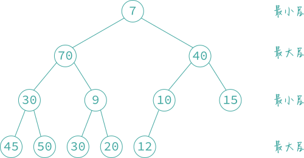

### 9.1 最小-最大堆

- **「双端优先队列 double-ended priority queue」** 是一种支持如下操作的数据结构：
  1. 插入一个具有任意关键字值的元素。
  2. 删除关键字值最大的元素。
  3. 删除关键字值最小的元素。
  
- 采用 **「最小-最大堆 min-max heap」** 可以同时支持上述全部操作。最大堆无法删除最小的元素，最小堆无法删除最大的元素。
  「最小-最大堆」是一个满足如下条件的完全二叉树：该二叉树不为空，其上的每个元素都有一个称为关键字的域。针对该关键字域，二叉树的各层教体委最小层和最大层，且根结点位于最小层。设 $$x$$ 是最小-最大堆中的任意一个结点，如果 $$x$$ 位于最小层，那么 $$x$$ 就是以 $$x$$ 为根结点的二叉树中关键字值最小的结点，称该结点为最小结点。类似地，如果 $$x$$ 位于最大层，那么 $$x$$ 就是以 $$x$$ 为根结点的二叉树中关键字值最大的结点，称该结点为最大结点。

    

    最小-最大堆
    

