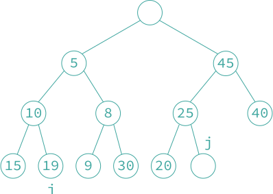
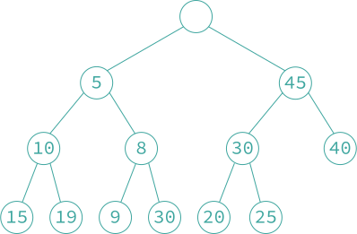

### 9.2 双端堆

- **「双端堆 deap, double-ended heap」** 是支持双端优先队列的插入、删除最小元素和删除最大元素等操作的堆。其比最小-最大堆上的相应操作还要快一个常数因子，而且算法更加简单。双端堆是一棵完全二叉树，该完全二叉树要么为空，要么同时满足下列性质：
  1. 根结点不包含元素。
  2. 左子树是一个最小堆。
  3. 右子树是一个最大堆。
  4. 如果右子树不空，则令 $$i$$ 是左子树中任意一个结点，$$j$$ 是 $$i$$ 在右子树中的对应结点。如果 $$i$$ 在右子树中的对应结点 $$j$$ 不存在，则令 $$j$$ 为 $$i$$ 的父结点在右子树中的对应结点。对于结点 $$i$$ 和 $$j$$，结点 $$i$$ 的关键字值小于等于结点 $$j$$ 的关键字值。即 $$j = i + 2^{\lfloor \log_2i\rfloor -1}$$；如果 $$(j > n)$$，则 $$j /= 2$$。


<div align="center">
    <p style="color:#3ea69f">
    双端堆
    </p>
</div>

- **『插入操作』** 假设要在上图所示的堆中插入关键字值为 4 的元素，新结点的位置在下图中的 $$j$$ 结点的位置。插入过程首先把关键字值 4 与 $$j$$ 在最小堆中的对应结点 $$i$$ 的关键字值进行比较，此处结点 $$i$$ 包含关键字值 19。由于 4 < 19，则将关键字值为 19 的元素移到结点 $$j$$ 中，移动后右边的最大堆的性质保持不变，不需要进行调整。现在只需利用最小堆的插入算法将 4 插入最小堆中的位置并进行调整（如下面第二张图）。若插入的关键字值为 30 的元素，由于 19 < 30，只需利用最大堆的插入算法将 30 插入到最大堆中位置 $$j$$ 并进行调整（如下面第三张图）。




<div align="center">
    <p style="color:#3ea69f">
    插入 4 后的双端堆
    </p>
</div>



<div align="center">
    <p style="color:#3ea69f">
    插入 30 后的双端堆
    </p>
</div>

函数 `deap_insert` 实现了插入的过程。其时间复杂度为 $$O(\log n)$$。此函数调用了下面的函数：

1. `max_heap(n)` 该函数将返回 `true` 当且仅当 `n` 位于双端堆中的最大堆中。
2. `min_partner(n)` 该函数计算最大堆结点 `n` 对应的最小堆结点。这可以由 $$n-2^{\lfloor \log_2n\rfloor -1}$$ 确定。
3. `max_partner(n)` 该函数计算最小堆结点 `n` 的父结点对应的最大堆结点。这可以由 $$(n+2^{\lfloor \log_2n\rfloor -1})/2$$ 确定。
4. `min_insert` 和 `max_insert` 这两个函数分别将一个元素插入最小堆和最大堆中的指定位置。插入过程是在相应的堆中沿着指定位置到根结点的路径进行比较，必要时将相关元素下移，直到找到插入新元素的正确位置为止。

```c++
void deap_insert(element deap[], int *n, element x)
{
    int i;
    (*n) ++;
    if (*n == MAX_SIZE) {
        fprintf(stderr, "The heap is full\n");
        exit(1);
    }
    if (*n == 2)
        deap[2] = x;
    else switch (max_heap(*n)) {
        case false:
            i = max_partner(*n);
            if (x.key > deap[i].key) {
                deap[*n] = deap[i];
                max_insert(deap, i, x);
            }
            else
                min_insert(deap, *n, x);
            break;
        case true:
            i = min_partner(*n);
            if (x.key < deap[i].key) {
                deap[*n] = deap[i];
                min_insert(deap, i, x);
            }
            else
                max_insert(deap, *n, x);
    }
}
```

- **『删除最小元素操作』** 
