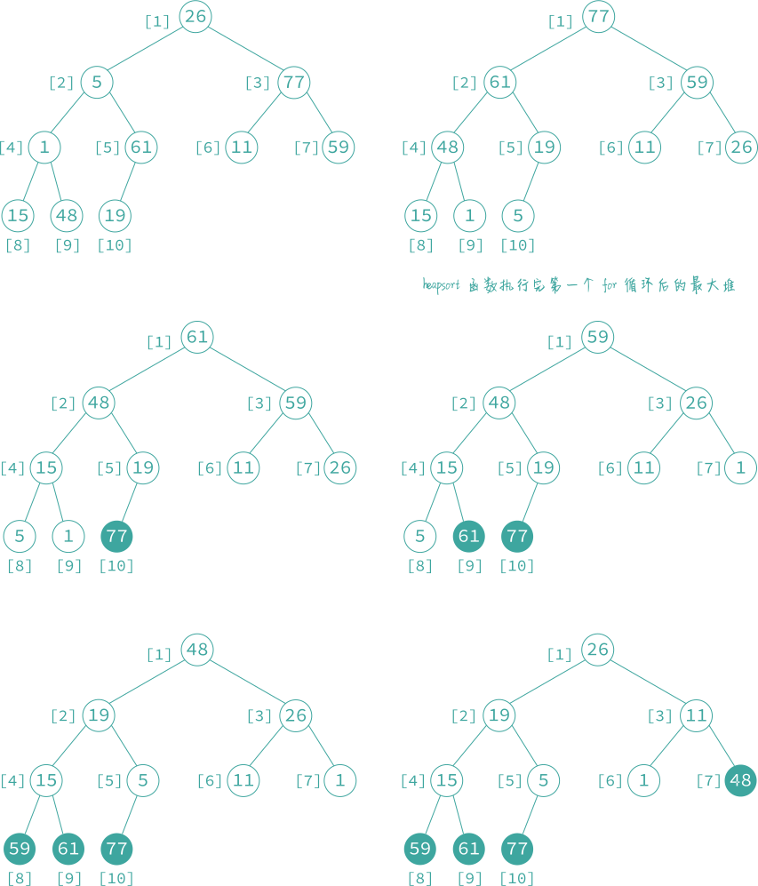

### 7.7 堆排序

堆排序在最坏情况下和平均情况下的时间复杂度均与归并排序相同，都为 $$O(n \log n)$$，但堆排序的空间复杂度为 $$O(1)$$，虽然堆排序要比空间复杂度为 $$O(n)$$ 的归并算法要稍慢一些，但比空间复杂度为 $$O(1)$$ 的归并算法要快。

首先将待排序的表转换为最大堆，并将堆中的第一个记录和最后一个记录进行交换。由于第一个记录总是最大关键字的记录，所以经过交换后，该记录排在有序的位置上，然后对堆进行重新调整。将上述操作执行 $$n - 1$$ 遍，即可得出排序正确的表。下面函数 `adjust` 的参数 `list` 的 `root` 结点可能不满足堆的性质，函数将 `root` 结点与其子结点进行比对并进行调整，使得整个二叉树满足堆的性质。函数 `heapsort` 实现了堆排序的策略。调用方式为 `heapsort(list, n)`。

```c++
void adjust(element list[], int root, int n)
{
    int child, rootkey;
    element temp;
    temp = list[root];
    rootkey = list[root].key;
    child = 2 * root; // 左孩子
    while (child <= n) {
        if ((child < n) && (list[child].key < list[child+1].key))
            child++;
        if (rootkey > list[child])
            break;
        else {
            list[child / 2] = list[child];
            child *= 2;
        }
    }
    list[child / 2] = temp;
}
```

```c++
void heapsort(element list[], int n)
{
    int i, j;
    element temp;

    for (i = n/2; i > 0; i--)
        adjust(list, i, n);
    for (i = n-1; i > 0; i--) {
        SWAP(list[1], list[i+1], temp);
        adjust(list, 1, i);
    }
}
```

如果该二叉树的深度为 $$d$$，`adjust` 函数中的 `while` 循环将至多执行 $$d$$ 次，因此，其时间复杂度为 $$O(d)$$。假设 $$2^{k-1} \leq n < 2^k$$，则该树有 $$k$$ 层且其第 $$i$$ 层的结点数为 $$2^{i-1}$$。且函数 `heapsort` 在第一个 `for` 循环中，将在每个有儿子的结点上调用一次 `adjust` 函数。因此，这个循环所需的时间是每一层的结点数乘以这些结点移动的最大距离的总和，该值不超过：
$$
\sum_{i=1}^k2^{i-1}(k-1) = \sum_{i-1}^k2^{k-i-1}i \leq n\sum_{i=1}^{k-1}\frac{i}{2^i} < 2n = O(n)
$$
在第二个 `for` 循环中，函数 `heapsort` 调用函数 `adjust` 共 $$n - 1$$ 次，且树的最大深度为 $$\lceil \log_2(n+1) \rceil$$。因此，该循环的计算时间为 $$O(n\log n)$$，所以总的计算时间为 $$O(n\log n)$$。

假定输入序列为 26, 5, 77, 1, 61, 11, 59, 15, 48, 19，堆排序的过程如下图所示。

